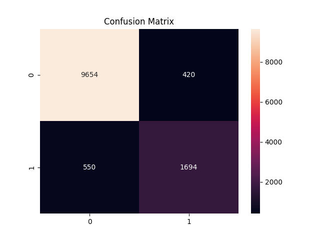
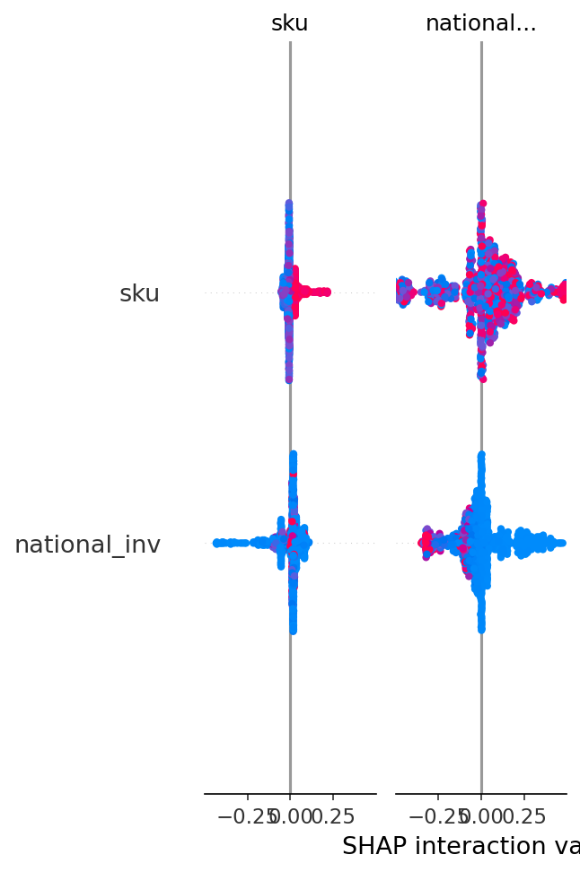

# Backorder Prediction using Machine Learning

## Project Overview

In supply chain management, a **backorder** occurs when customer demand exceeds available inventory.  
Predicting backorders in advance helps organizations improve **inventory planning, reduce delays, and prevent stock shortages**.

This project builds an **end-to-end machine learning pipeline** to predict whether a product will go on backorder using historical supply chain data.

The system includes **data preprocessing, machine learning models, explainability techniques, and an API for real-time predictions.**

---

## Problem Statement

Supply chain systems generate large amounts of operational data such as:

- Inventory levels
- Sales history
- Demand forecasts
- Supplier performance
- Lead time

Using this data, we aim to **predict whether a product will go on backorder** before the shortage occurs.

Early predictions allow companies to take proactive actions such as:

- Increasing inventory
- Adjusting procurement schedules
- Improving demand planning

---


## Project Workflow
```
Supply Chain Dataset
│
▼
Data Cleaning & Preprocessing
(Pandas, Feature Engineering)
│
▼
Handling Class Imbalance
(SMOTE)
│
▼
Model Training
Decision Tree → XGBoost
│
▼
Hyperparameter Tuning
(GridSearchCV)
│
▼
Model Explainability
(SHAP)
│
▼
Deployment
(FastAPI REST API)
```


---

## Technologies Used

- **Python**
- **Pandas**
- **NumPy**
- **Scikit-Learn**
- **XGBoost**
- **SHAP (Explainable AI)**
- **FastAPI**
- **Jupyter Notebook**
- **Matplotlib / Seaborn**

---

## Machine Learning Models

### 1. Decision Tree (Baseline Model)
A simple interpretable model used to establish a baseline prediction performance.

### 2. Hyperparameter Tuned Decision Tree
Improved performance using **GridSearchCV**.

### 3. XGBoost Model
An advanced gradient boosting model used to achieve better prediction accuracy.

---

## Handling Class Imbalance

The dataset contains **imbalanced classes**, where backorders occur less frequently.

To address this issue, **SMOTE (Synthetic Minority Oversampling Technique)** was used to balance the dataset and improve model performance.

---

## Model Explainability

To understand how the model makes predictions, **SHAP (SHapley Additive Explanations)** was used.

SHAP helps identify:

- Which features influence predictions the most
- How each feature contributes to predicting a backorder

This improves **model transparency and trustworthiness**.

---

## Key Features Influencing Backorders

The model found that the following features strongly influence backorder predictions:

- Low inventory (`national_inv`)
- High demand forecast (`forecast_3_month`)
- Long supplier lead time (`lead_time`)
- High past sales volume
- High minimum bank stock requirement

These insights can help supply chain teams **anticipate shortages earlier.**

---

## API Deployment

The trained model is deployed using **FastAPI**, allowing real-time predictions through a REST API.

Example API request:

```json
{
"national_inv": 10,
"lead_time": 5,
"in_transit_qty": 2,
"forecast_3_month": 50,
"forecast_6_month": 80,
"forecast_9_month": 120,
"sales_1_month": 10,
"sales_3_month": 30,
"sales_6_month": 50,
"sales_9_month": 70,
"min_bank": 20,
"pieces_past_due": 0,
"perf_6_month_avg": 0.9,
"perf_12_month_avg": 0.85,
"local_bo_qty": 0
}

```

## Repository Structure
```
Backorder-Prediction
│
├── data
│   └── backorder dataset
│
├── notebooks
│   ├── baseline_decision_tree.ipynb
│   └── advanced_models.ipynb
│
├── src
│   ├── preprocessing.py
│   ├── train_model.py
│   ├── evaluate.py
│   ├── save_model.py
│   ├── evaluate.py
│   └── logger.py
│
├── advanced_models
│   ├── imbalance_handling.py
│   ├── gridsearch_tuning.py
│   ├── xgboost_model.py
│   └── shap_explainability.py
│
├── api
│   ├── main.py
│   ├── predictor.py
│   └── schema.py
│
├── models
│   └── trained_model_v1.pkl
│
└── results
    ├── confusion_matrix.png
    └── shap_summary.png
```

## How to Run the Project

# Install Dependencies
pip install -r requirements.txt
uvicorn api.main:app --reload

Run FastAPI server
uvicorn api.main:app --reload

Open API documentation:
http://127.0.0.1:8000/docs


## Future Improvements

Feature engineering for demand forecasting
Model comparison with Random Forest and LightGBM
Docker containerization for deployment
CI/CD pipeline for ML model updates


Results:

## Model Evaluation



## Feature Importance




```
~\ML-Models\Decision-Tree\Backorder-Prediction> python.exe .\src\train.py --model xgboost
2026-03-02 14:19:31,975 - logger - INFO - Loading dataset
2026-03-02 14:19:33,333 - logger - INFO - Preprocessing data
2026-03-02 14:19:33,406 - logger - INFO - Splitting data
2026-03-02 14:19:33,435 - logger - INFO - Training XGBoost model
2026-03-02 14:19:34,940 - logger - INFO - Evaluating model
Accuracy: 0.9212534502354278

Classification Report

              precision    recall  f1-score   support

       False       0.95      0.96      0.95     10074
        True       0.80      0.75      0.78      2244

    accuracy                           0.92     12318
   macro avg       0.87      0.86      0.86     12318
weighted avg       0.92      0.92      0.92     12318

2026-03-02 14:20:40,465 - logger - INFO - Saving model
2026-03-02 14:20:40,476 - logger - INFO - Training pipeline completed successfully
```

## Interpretation of the Classification Report

```
| Class                | Precision | Recall | Meaning                                   |
| -------------------- | --------- | ------ | ----------------------------------------- |
| False (No Backorder) | 0.95      | 0.96   | Model predicts normal inventory very well |
| True (Backorder)     | 0.80      | 0.75   | Model misses some backorders              |
```


The important metric here is Recall for True class. As Model catches 75% of real backorders. In supply chain, recall is more important than accuracy because missing backorders is costly. This is why I have applied SMOTE + XGBoost
```
Recall = 0.75
```

## Benchmark table
```
Model Performance

Decision Tree
Accuracy: 0.898
Recall (Backorder): 0.61

XGBoost
Accuracy: 0.921
Recall (Backorder): 0.75
```


## Model Explainability

SHAP (SHapley Additive exPlanations) is used to interpret model predictions.

Benefits:
- Identify features influencing backorders
- Improve supply chain decision making
- Increase trust in ML predictions

Visualization:
- SHAP summary plot
- Feature impact analysis


| Skill            | Level |
| ---------------- | ----- |
| Data Science     | ⭐⭐⭐⭐  |
| Machine Learning | ⭐⭐⭐⭐  |
| Explainable AI   | ⭐⭐⭐⭐  |
| ML Pipeline      | ⭐⭐⭐⭐  |
| Model Deployment | ⭐⭐⭐⭐  |
| API Development  | ⭐⭐⭐⭐  |


model (Decision Tree / XGBoost) typically predicts high probability of backorder when

| Feature                    | Risk Pattern              |
| -------------------------- | ------------------------- |
| inventory (`national_inv`) | **very low**              |
| forecast                   | **very high**             |
| sales                      | **high**                  |
| lead_time                  | **long**                  |
| in_transit_qty             | **low**                   |
| min_bank                   | **higher than inventory** |
| pieces_past_due            | **> 0**                   |
| local_bo_qty               | **> 0**                   |


# For 95% Probability
```

{
"national_inv": 0,
"lead_time": 30,
"in_transit_qty": 0,
"forecast_3_month": 500,
"forecast_6_month": 800,
"forecast_9_month": 1200,
"sales_1_month": 120,
"sales_3_month": 350,
"sales_6_month": 600,
"sales_9_month": 900,
"min_bank": 100,
"pieces_past_due": 20,
"perf_6_month_avg": 0.4,
"perf_12_month_avg": 0.45,
"local_bo_qty": 10
}

Response
{
  "prediction": true,
  "probability": 0.9588819875776398
}
HTTP status: 200
```
